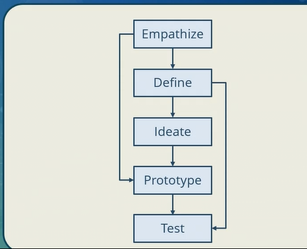
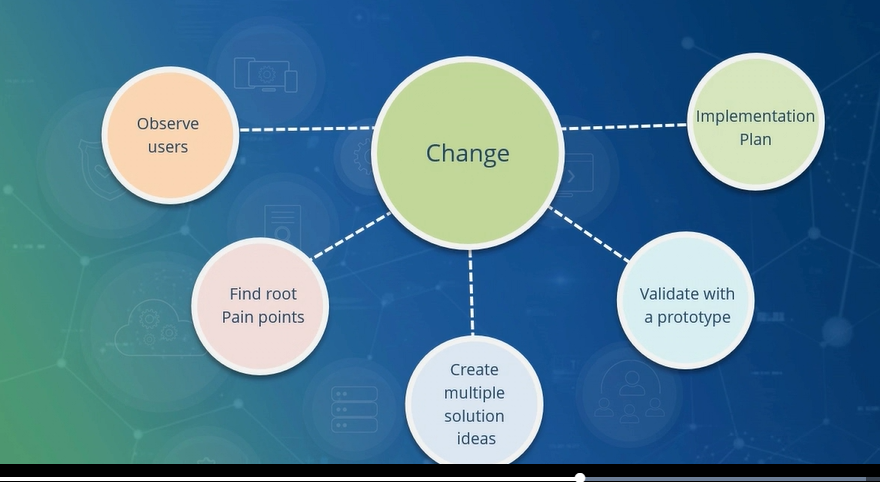

# DevOps Design Practice - the design thinking approach that we can apply to complement DevOps Design Practice
In order to cultivate and bring in the culture of DevOps in an organization, along with agility or Agile principle, we need to adopt the right process. Design thinking approach provides capability of mapping how a human thinks, along with how solutions can be derived. Let's try to understand the process.

Design thinking is divided into five critical phases. 
* __Empathize__: First phase is empathize. Here, IT works to develop a deep and more meaningful understanding of how a user or a customer or the stakeholder will interact with the system and the processes which are associated with the system. This will give the real experience which a user wants. Once you understand the experience expected by the user, you need to go and define. 
* __Define__: In define phase, we need to place user experience in the context of the problem, and then elaborate it to DevOps team so that they can proceed towards a solution to provide the best possible outcome. 
* __Ideate__: Third process is ideate. Ideate is all about coming up with possible solutions. 
* __Prototype__: The fourth phase is the prototype. Instead of building out the entire system, we need to focus on building the prototype in order to ensure that we gather experience from the intended user, and then implement the suggestions which are made on the prototype. 
* __Test__: Finally, we test phase. Test is all about refining the prototype in order to bring in the actual and the real improved customer experience that is required from the product. 

All these five phases can be applied in order to derive DevOps processes as well.
# How Design thinking helps Agile
We need to understand that we will have a design thinking cycle, and that cycle will start with observing the user. We need to observe the user and we need to derive all the observations of the user, understand the real pain or find out the painpoints which the user is facing for which we are planning to build a solution.Then we need to come up with multiple solution ideas. When we create multiple ideas to bring in the solution, we need to ensure that solution maps to the intended goal. Finally, we have to go and prepare a prototype, and we have to validate the idea that we have implemented with the prototype, whether it is taking care of all the painpoints of the user or not. Once you have validated and refined your prototype, we need to have an implementation plan where we go and finalize what needs to be implemented and start the implementation process.

# Applying Design Thinking on DevOps
After understanding how we apply design thinking on agility to derive a solution, let's apply design thinking on DevOps. DevOps is represented by bringing in collaborative development and operations effort by different teams.It's a combination of Agile development along with operations. We can apply design thinking and get a lean start up. We need to identify the opportunities and challenges.Then we need to again, come up with different solutions that we can provide in order to ensure that collaborative efforts of team and insight of system is built by conducting walkthroughs among the team. We need to build a prototype and validate the prototype. Once we have validated the prototype, we can adopt a __minimum viable product__ maturity model. Once this model is defined, we can adopt the identified Agile principles that can be applied on development and DevOps principle which can enhance collaboration among development and operations team with focus on automation.
# Benefits of Applying Design Thinking on DevOps
* First benefit is it reduces time-to-market because we are capturing users' expectation directly.
* It can also reduce cost and provide better return on investment.Since customers are directly interacting with the prototype and we are collecting the feedback, we can provide improved customer retention and loyalty. 
* When we apply design thinking approach and come up with various solutions, it fosters innovation in the team.
* And finally, it encourages cross-team collaboration, because developers and operations will have a common objective. Yes, tasks that they will do will be different, but at some point of time,they will collaborate and make the entire system operational.