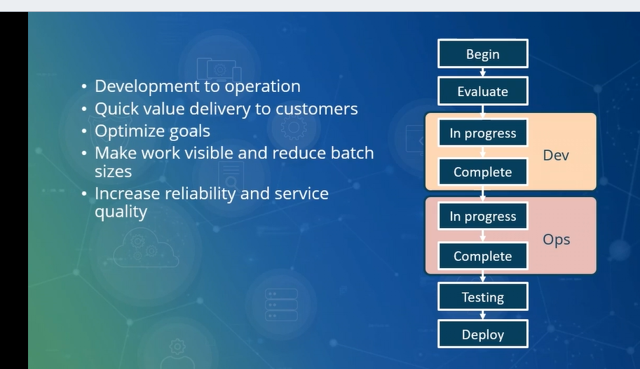
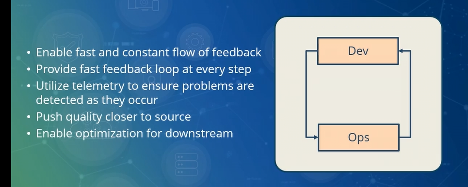
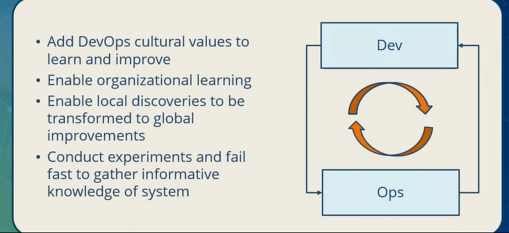
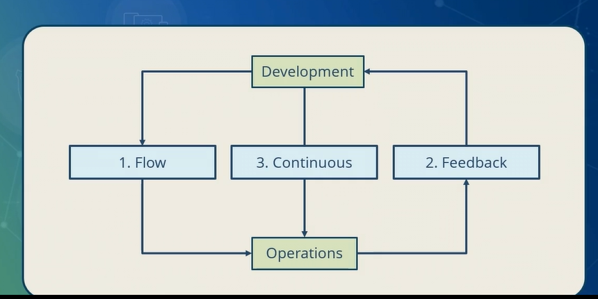

# Devops Three principles: Flow, Feedback and Continuous Learning

## 1. The principle of FLOW
First principle is principle of flow which enumerates how actually we'll move from 
**development** of artifacts to **management** of those artifacts using operations.
Principle of flow is all about how to have __transition__ from __development__ to __operation__, keeping in mind iteration.
It also depicts how we can __deliver quick value__ to the intended customers.
Apart from that, it also ensures optimization of goal by ensuring that we have __collaborated understanding of goal__.
In order to ensure that collaboration works better, __it makes work visible__ and reduces the batch sizes.
And finally, it increases reliability and service quality.
Now let's talk about how the principle of flow actually starts the transition.
It starts with evaluating the solution. And then moving on to the development practice, 
where you can have two different states: __in progress__, or __completed__ state.
Completed state is also popularly known as __done__ state.You can have various intermediary stages as well 
depending on the control that you want at different level of development processes.
When it comes to operations, it's all about whether your __developed artifacts__ are made available 
in __operational environment__ or not. It can be in progress or completed.
You have to have __testing of the components__, as well as a __testing of the operational environment__ 
and then, finally deploy the artifacts to make it available to the end user.

## 2. The Principle of Feedback
The Principle of feedback cultivates culture of quick feedback availability in order to improvise the product.
The principle of feedback helps in amplifying the productivity of the product and it does so by having frequent feedback loops. It enables fast and constant flow of feedback among different participants or different stakeholders, which includes developers as well as operations. Primary objective of having continuous feedback is to ensure that feedbacks arrive fast in the loop and at every step of the flow.It utilizes telemetry to have proper identification and detection of the problem as soon as they occur. Continuous feedback also promotes quality closer to the source and it enables optimization for the downstream users.

## 3. The Principle of Continuous Learning 
The principle of continuous learning ensures frequent improvements of the product.
We learn from what we do.And in DevOps culture, it adds value and enables entire team to learn and improve from the feedback which has been received from end user about the product. It can also promote and enable organizational learning by adopting the right tool which can enhance sharing of the content. Continual learning also enables local discoveries that are made and it helps to create a repository which can be further used in global improvements or transformations.In order to ensure that you are able to adopt to the culture of continual learning, you need to conduct frequent experiments and fail fast. Fail fast will ensure that you gather more insight about the system and improvise it as and when required.

# Knitting All three Principles Together
Let's put all three together in a single flow in order to ensure that we have adopted all the three principles together. This single flow indicates collaboration between development and operations team. Starting with the flow.Flow provides capability of __continuous integration, delivery, and deployment__.And it also helps us to identify the right value stream and map it.We can adopt __Kanban__ or __Scrum__ in order to manage the flow. The second principle is adopted, again, to establish proper collaboration between development team and operations team. And that can be done by continuous experimentation, learning, and also adopting improvement to the failures. Finally, the Feedback is all about peer review, monitoring, promoting and learning by using dashboards, having the right process measurement in place, and adopting practices like ITSM ( Information Technology Service Management) which focuses on:

* __Incident management__: Efficiently handling and resolving issues.
* __Change management__: Ensuring that changes to systems are tracked and managed to minimize disruptions.
* __Problem management__: Identifying and mitigating the root causes of issues.
* __Service request management__: Handling user requests for new services or modifications to existing ones.
